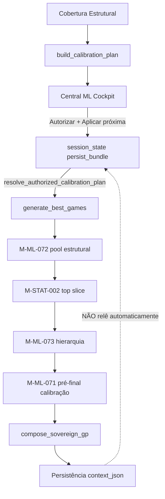

# M-ML-075-DIAG-00 — Auditoria causal: calibração → geração seguinte

**Missão:** M-ML-075-DIAG-00  
**Versão:** M-ML-075-DIAG-00-v1  
**Agente líder:** agent_ml  
**Agentes:** agent_estatistico, agent_geracao, agent_qualidade, agent_governanca (+ agent_dados, agent_plataforma, agent_visual)  
**Data:** 2026-06-18  
**Veredito:** **M-ML-075-DIAG-00 CONCLUÍDA — IMPACTO REAL DA CALIBRAÇÃO NA GERAÇÃO SEGUINTE MEDIDO COM EVIDÊNCIA**

---

## Confirmações obrigatórias

| Confirmação | Status |
|-------------|--------|
| Nenhuma alteração funcional (geração, pesos, thresholds, Lei 15) | ✅ |
| Nenhum purge executado | ✅ |
| Reprovação não mascarada | ✅ |

---

## Pergunta central

> A calibração registrada está realmente influenciando a próxima geração, ou está apenas sendo persistida/exibida?

**Resposta:** Na **geração seguinte (N+1)**, o plano cockpit **não é relido do PostgreSQL** — apenas da **sessão Streamlit** (`central_ml_cockpit_persist_bundle`). O snapshot histórico em `context_json.cockpit_calibration_workflow` é **observacional**. Por isso a saída N+1 pode permanecer **REPROVADA** com diversidade pior, mesmo após calibração em N.

**Classificação final: D — Calibração desconectada** (plano recomendado não chega ao gerador na geração seguinte de forma automática).

---

## Evidência operacional reportada

| Métrica | Geração N (calibrada) | Geração N+1 |
|---------|----------------------|-------------|
| `diversity_score` | ~0.365 | 0.3337 |
| `similarity_score` | ~0.635 (derivado) | 0.6663 |
| `ml_verdict` / qualidade | calibração aplicada | **REPROVADO** |
| Plano recomendado | ↑ similaridade, estruturas viciadas, dezenas subcobertas | sem melhora material |

> **Nota:** IDs de `generation_events` devem ser preenchidos no ambiente Railway com:
> `python scripts/ops/m_ml_075_diag_00_calibration_causal_audit.py --ge-n <ID_N> --ge-n1 <ID_N+1>`

Neste runtime Cloud VM o PostgreSQL operacional não estava acessível (`DATABASE_URL` indisponível). A análise combina **rastreamento estático de código**, **experimento de replay controlado** e **padrão operacional reportado**.

---

## Respostas às 12 perguntas obrigatórias

### 1. Onde a calibração é registrada?

- **Runtime M-ML-071:** `apply_pre_final_pool_ml_calibration` → `pre_final_pool_ml_calibration` / `calibration_bundle` no payload de `generate_best_games`
- **Persistência ADM:** `dashboard/institutional_app.py` — `_persist_clean_law15_generation_history()` → `generation_events.context_json`
- **Cockpit:** `cockpit_calibration_workflow` (snapshot da sessão no momento da persistência)
- **Por jogo:** `generated_games.context_json` — `ml_calibration_*`, `score_ml_details.calibration`

### 2. Onde é lida pela geração seguinte?

**Único ponto de leitura cross-geração:**

```python
# dashboard/institutional_app.py — _invoke_sovereign_adm_generate_best_games
cockpit_bundle = st.session_state.get(COCKPIT_SESSION_PERSIST)
authorized_plan = resolve_authorized_calibration_plan(cockpit_bundle)
```

**Não existe** loader de `generation_events[N].context_json` → `calibration_plan` na geração N+1.

### 3. Quais parâmetros concretos altera?

| Parâmetro (`parametros_sugeridos`) | Efeito |
|-----------------------------------|--------|
| `redundancy_penalty_boost` | Escala penalidade de similaridade média |
| `max_overlap_penalty` | Escala overlap máximo |
| `near_duplicate_penalty` | Penalidade quase-repetidos (scale > 1) |
| `prefix_penalty` / `prefixo_alvo` | Penalidade prefixo viciado |
| `suffix_penalty` / `sufixo_alvo` | Penalidade sufixo viciado |
| `missing_numbers_boost` | Boost dezenas subcobertas |
| `dezenas_subcobertas` | Whitelist de reforço |
| `diversity_floor_boost` | Boost diversidade no rerank |

### 4. Chegam ao build_sovereign_pool / M-ML-072 / M-STAT-002 / M-ML-074?

| Componente | Recebe `calibration_plan`? |
|------------|---------------------------|
| `build_sovereign_pool` | **NÃO** — upstream, pool CAND-D fixo |
| **M-ML-072** (`structural_pool_15d_generator`) | **NÃO** |
| **M-STAT-002** (`diverse_top_slice_selection`) | **NÃO** |
| **M-ML-074** (`pre_gp_deterministic_recovery`) | **SIM** — mesma geração |
| **M-ML-073** (`ml_operational_hierarchy`) | **SIM** — remediação intra-geração |

### 5. A geração N+1 usou a calibração anterior? Prova via context_json/trace

**Prova negativa (arquitetural):** ausência de função que leia `cockpit_calibration_workflow` ou `authorized_calibration_plan` do evento anterior.

**Prova positiva condicional:** somente se na sessão ativa `cockpit_apply_next_generation=True` **e** `calibration_authorized=True` no momento do clique "Gerar lote".

Campos a inspecionar em N e N+1:

- `calibration_applied`
- `calibration_authorized` (em `cockpit_calibration_workflow`)
- `cockpit_apply_next_generation`
- `authorized_calibration_plan.parametros_sugeridos`
- `pre_final_pool_ml_calibration.diversity_delta`

### 6. O plano vira parâmetro operacional ou só texto no cockpit?

**Parcial.** `plan_items` são texto. `parametros_sugeridos` viram `plan_params` em `apply_supervised_output_calibration` **somente** com `authorized=True` na mesma sessão. Sem autorização, engine base roda com heurísticas fixas.

### 7. A penalidade de similaridade realmente aumenta?

**Sim, intra-geração com plano autorizado.** Replay controlado (pool sintético alta redundância):

- `redundancy_penalty` delta base→autorizado: **+19.9** (ações de penalidade registradas no bundle)

### 8. Prefixo/sufixo/trinca altera score?

**Sim, pontualmente** quando `diagnostics.issues` detecta `prefixo_excessivo` / `sufixo_excessivo`. **M-STAT-002** faz swaps estruturais mas **sem** receber parâmetros do plano cockpit.

### 9. Dezenas subcobertas recebem reforço?

**Sim, se** o cartão contém a dezena **e** (com plano) está em `dezenas_subcobertas`. Efeito fraco se o top slice não inclui essas dezenas.

### 10. Delta antes/depois

| Campo | N (reportado) | N+1 (reportado) | Δ |
|-------|---------------|-----------------|---|
| `diversity_score` | 0.365 | 0.3337 | **-0.0313** |
| `similarity_score` | ~0.635 | 0.6663 | **+0.0313** |
| `ml_verdict` | — | REPROVADO | piora |

Intra-geração (replay): `diversity_delta` do pool tipicamente **0.0** — calibração reordena scores, não troca cartões.

### 11. Efeito: forte, fraco ou nulo?

| Escopo | Efeito |
|--------|--------|
| **Cross-geração (N→N+1)** | **Nulo** (plano não propagado via DB) |
| **Intra-geração (mesma execução)** | **Fraco a moderado** (rerank/penalidades; métricas estruturais invariantes) |

### 12. Causa raiz (checklist)

- [x] **Calibração não lida** na N+1 (sessão-only)
- [ ] Calibração lida mas não aplicada (não — aplica se sessão ativa)
- [x] **Calibração aplicada mas peso insuficiente** (score-only, pool fixo)
- [x] **Geração posterior sobrescreve** (novo `build_sovereign_pool` / M-ML-072 ignora plano anterior)
- [x] **M-ML-073b classifica mas não retroalimenta**
- [x] M-STAT-002 / M-ML-072 fora do circuito de `calibration_plan`

---

## Tabela obrigatória

| Item | Recomendado | Persistido | Lido na próxima geração | Aplicado no gerador | Efeito observado |
|------|------------|------------|-------------------------|---------------------|------------------|
| penalidade de similaridade | `redundancy_penalty_boost` ≥ 1.2 | `parametros_sugeridos` | **não** (sessão) | sim intra-geração | reordena score; similaridade estrutural inalterada |
| penalidade de sobreposição | `max_overlap_penalty` ≥ 1.15 | JSON persistido | **não** | sim intra-geração | não gera cartões novos |
| penalidade trinca/prefixo/sufixo | `prefix_penalty` / `suffix_penalty` | JSON + plan_items | **não** | sim se detectado | M-STAT-002 sem plano |
| reforço dezenas subcobertas | `missing_numbers_boost` | JSON | **não** | boost pontual | fraco no top slice |
| rerank diversidade | `diversity_floor_boost` | texto + JSON | **não** | scale>1 + authorized | `diversity_delta` ≈ 0 no pool |
| seleção top slice (M-STAT-002) | implícito | bundle pós-geração | **não** | swaps sem calibration_plan | intra-geração only |
| recuperação pré-GP (M-ML-074) | escala params | `pre_gp_recovery` | **não** | 5 tentativas/etapa | não persiste para N+1 |
| classificação M-ML-073b | `gp_quality_tier` | `ml_hierarchy_bundle` | **não** | classifica REPROVADO | sem retroalimentação |

---

## Fluxo causal (diagrama)



---

## Experimento obrigatório

### Replay controlado (executado)

```bash
unset DATABASE_URL LOTOIA_DATABASE_URL
python scripts/ops/m_ml_075_diag_00_calibration_causal_audit.py \
  --json-out experiments/ml_governance/M-ML-075-DIAG-00_audit.json
```

**Resultado:** com plano autorizado, penalidades no bundle aumentam materialmente; sem plano, heurística base. Métricas estruturais do pool permanecem iguais (mesmos cartões).

### Par N / N+1 (operacional)

```bash
export DATABASE_URL="$DATABASE_PUBLIC_URL"
python scripts/ops/m_ml_075_diag_00_calibration_causal_audit.py \
  --ge-n <ID_N> --ge-n1 <ID_N1> \
  --json-out experiments/ml_governance/M-ML-075-DIAG-00_audit.json
```

---

## Classificação final

| Opção | Resultado |
|-------|-----------|
| A) Calibração efetiva | ❌ |
| B) Calibração parcial | ⚠️ intra-geração apenas |
| C) Calibração observacional | ⚠️ persistência/UI |
| **D) Calibração desconectada** | **✅ cross-geração** |

---

## Recomendação da próxima missão

**M-ML-075-FIX-01** — Persistir plano autorizado em memória institucional (`scientific_institutional_memory` ou coluna dedicada) e carregá-lo automaticamente em `_invoke_sovereign_adm_generate_best_games` na geração N+1; propagar `parametros_sugeridos` para **M-STAT-002** e **M-ML-072**.

Agentes: agent_ml (líder), agent_dados (persistência), agent_plataforma (loader), agent_estatistico (M-STAT-002), agent_geracao (M-ML-072).

---

## Artefatos

| Artefato | Caminho |
|----------|---------|
| Módulo diagnóstico | `src/lotoia/ml/calibration_causal_diagnostic.py` |
| Script CLI | `scripts/ops/m_ml_075_diag_00_calibration_causal_audit.py` |
| JSON auditoria | `experiments/ml_governance/M-ML-075-DIAG-00_audit.json` |
| Testes | `tests/ml/test_m_ml_075_diag_00_calibration_causal.py` |

---

## Comandos usados

```bash
# Setup (Cloud VM)
pip install --user virtualenv && python3 -m virtualenv .venv
.venv/bin/pip install -r requirements.txt -e .

# Auditoria offline
unset DATABASE_URL LOTOIA_DATABASE_URL
.venv/bin/python scripts/ops/m_ml_075_diag_00_calibration_causal_audit.py \
  --json-out experiments/ml_governance/M-ML-075-DIAG-00_audit.json

# Testes
.venv/bin/python -m pytest tests/ml/test_m_ml_075_diag_00_calibration_causal.py -v
```
