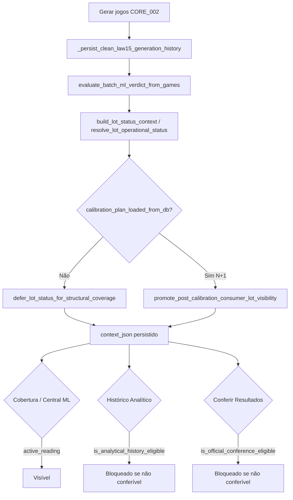

# M-OPS-064-AUDIT-00 — Auditoria causal: promoção do lote calibrado para Histórico Analítico e Conferir Resultados

**Missão:** M-OPS-064-AUDIT-00  
**Versão:** M-OPS-064-AUDIT-00-v1  
**Agente líder:** agent_dados  
**Agentes obrigatórios:** agent_plataforma, agent_geracao, agent_ml, agent_visual, agent_qualidade, agent_governanca  
**Agente de apoio:** agent_estatistico  
**Data:** 2026-06-18  
**Veredito:** **M-OPS-064-AUDIT-00 CONCLUÍDA — TRANSIÇÃO DO LOTE CALIBRADO PARA HISTÓRICO/CONFERIR MAPEADA COM EVIDÊNCIA**

---

## Confirmações obrigatórias

| Confirmação | Status |
|-------------|--------|
| Nenhuma correção funcional aplicada nesta missão | ✅ |
| Nenhum purge executado | ✅ |
| CORE_002 / Lei 15 / Lei 15A intactos | ✅ |
| `public_app` não alterado | ✅ |
| Status não mascarados | ✅ |

---

## Pergunta central

> Onde no código um lote sai de `needs_calibration` / `pending_structural_review` para `approved_with_warning` / `approved_for_officialization` / `officialized` (ou status conferível equivalente)? Essa transição existe? É automática? É manual?

**Resposta resumida:** A **única** função que atribui status conferível é `resolve_lot_operational_status()` em `src/lotoia/operations/lot_operational_status.py`, chamada **somente na persistência** via `build_lot_status_context()` → `_persist_clean_law15_generation_history()`. **Não existe** função posterior que promova um `generation_event` já persistido para status conferível. Os botões do cockpit (Autorizar / Aplicar na próxima / Validar) **não** alteram `lot_operational_status` no PostgreSQL. Para o lote **N+1 consumidor do plano DB**, `promote_post_calibration_consumer_lot_visibility()` **força** `pending_structural_review`, impedindo qualquer status conferível mesmo quando o veredito ML seria `APROVADO`.

**Classificação final: C** — promoção conferível **não existe** para o lote calibrado N+1 no fluxo soberano atual. Elemento secundário **B**: a promoção existe na persistência genérica, mas não é alcançada após N+1 calibrado (bloqueio estrutural + veredito ML + override M-ML-075-FIX-01).

---

## Fluxo soberano mapeado



**Ponto exato onde a promoção deveria ocorrer (e não ocorre para N+1):** após persistência do lote N+1 com `calibration_plan_applied_to_generation=true` e veredito ML `APROVADO` / `APROVADO COM ALERTA`, **antes ou em vez de** `promote_post_calibration_consumer_lot_visibility()` — ou via job/botão explícito que atualize `generation_events.context_json.lot_operational_status` para status em `OFFICIAL_CONFERENCE_STATUSES`.

---

## Tabela 1 — Status operacionais

| Status | Onde é criado | Quem consome | Entra no Histórico? | Entra no Conferir? | Observação |
|--------|---------------|--------------|---------------------|--------------------|------------|
| `pending_structural_review` | `resolve_lot_operational_status()` (fallback); `defer_lot_status_for_structural_coverage()`; **`promote_post_calibration_consumer_lot_visibility()` (N+1)** | Cobertura Estrutural, Central ML (`ACTIVE_STRUCTURAL_READING_STATUSES`) | Não | Não | Status padrão de lote gerado não liberado; **forçado em N+1** |
| `needs_calibration` | `resolve_lot_operational_status()` quando `ml_verdict=PRECISA CALIBRAR` | Cobertura, Central ML | Não | Não | Bloqueia conferência por design |
| `rejected` | `resolve_lot_operational_status()` quando `ml_verdict=REPROVADO` | Cobertura (via defer → `pending`), Central ML | Não | Não | Pode ser rebaixado visualmente para `pending` na Cobertura |
| `blocked_for_officialization` | `resolve_lot_operational_status()` quando `ml_verdict=BLOQUEADO PARA OFICIALIZAÇÃO` | Cobertura (via defer), Central ML | Não | Não | Clone estrutural / overlap crítico |
| `calibration_authorized` | `resolve_lot_operational_status()` (simulação ou `calibration_authorized` sem release) | Cobertura, Central ML | Não | Não | Workflow cockpit — não promove lote persistido |
| `calibration_applied` | `resolve_lot_operational_status()` quando `calibration_applied` sem `official_release_allowed` | INACTIVE (`PERSIST_TIME_INACTIVE_COVERAGE_STATUSES`) | Não | Não | Visibilidade Cobertura via defer apenas |
| `approved_for_officialization` | `resolve_lot_operational_status()` quando `official_release_allowed` sem veredito APROVADO/ALERTA explícito | Histórico, Conferir (`ANALYTICAL_HISTORY_STATUSES`) | **Sim** | **Sim** | Caminho teórico na persistência |
| `approved_with_warning` | `resolve_lot_operational_status()` quando `APROVADO COM ALERTA` + `official_release_allowed` | Histórico, Conferir | **Sim** | **Sim** | Requer ML liberado na persistência |
| `officialized` | `resolve_lot_operational_status()` quando `APROVADO` + `official_release_allowed` | Histórico, Conferir | **Sim** | **Sim** | Status conferível pleno |
| `superseded_by_calibration` | `merge_supersede_operational_fields()` / `_supersede_prior_lots_for_calibration()` | Auditoria apenas | Não | Não | Lote N após N+1 (sem `calibration_source_only`) |
| `calibration_source_only` | `merge_supersede_operational_fields(calibration_source_only=True)` após consumo do plano | Auditoria; excluído de leitura ativa | Não | Não | Lote N após M-ML-075-FIX-01 |
| `not_officialized` | Simulação / laboratório (`generation_origin=simulation`) | Simulação institucional | Não | Não | Explicitamente não oficializa |
| `discarded` / `failed_structural_validation` | `batch_operational_scope` (aliases / commander) | Inativo | Não | Não | Legado M-DADOS-ML-061 |

**Campos espelhados em `context_json`:** `operational_status`, `ml_validation_status`, `officialization_status`, `calibration_state`, `is_analytical_history_eligible`, `is_official_conference_eligible`, `official_release_allowed`, `validation_flow`, `ml_verdict`, `gp_quality_tier`.

---

## Tabela 2 — Transições

| Origem | Destino | Função | Condição | Existe hoje? | Evidência |
|--------|---------|--------|----------|--------------|-----------|
| (novo lote) | `needs_calibration` | `resolve_lot_operational_status()` | `ml_verdict=PRECISA CALIBRAR` | Sim | `lot_operational_status.py:117-118` |
| (novo lote) | `rejected` | `resolve_lot_operational_status()` | `ml_verdict=REPROVADO` | Sim | `lot_operational_status.py:115-116` |
| (novo lote) | `blocked_for_officialization` | `resolve_lot_operational_status()` | `ml_verdict=BLOQUEADO...` | Sim | `lot_operational_status.py:113-114` |
| (novo lote) | `pending_structural_review` | `resolve_lot_operational_status()` | veredito não bloqueante e `official_release_allowed=false` | Sim | `lot_operational_status.py:125` |
| (novo lote) | `officialized` | `resolve_lot_operational_status()` | `APROVADO` + `official_release_allowed` | Sim (persistência) | `lot_operational_status.py:121-122` |
| (novo lote) | `approved_with_warning` | `resolve_lot_operational_status()` | `APROVADO COM ALERTA` + `official_release_allowed` | Sim (persistência) | `lot_operational_status.py:119-120` |
| `rejected` / `blocked` / `calibration_applied` | `pending_structural_review` | `defer_lot_status_for_structural_coverage()` | gerador, não simulação, status inativo Cobertura | Sim | `lot_operational_status.py:215-245`; zera elegibilidade Histórico/Conferir |
| **qualquer status N+1** | **`pending_structural_review`** | **`promote_post_calibration_consumer_lot_visibility()`** | **`calibration_plan_loaded_from_db=true`** | **Sim — bloqueia promoção** | `lot_operational_status.py:180-212`; teste `test_promote_post_calibration_consumer_lot_visibility` |
| lote N (não conferível) | `calibration_source_only` | `mark_generation_events_superseded_by_calibration()` | plano consumido em N+1 | Sim | `institutional_app.py:12097-12110` |
| lote anterior | `superseded_by_calibration` | `_supersede_prior_lots_for_calibration()` | nova geração com calibração intra-sessão | Sim | `institutional_app.py:11576-11623` |
| `needs_calibration` → conferível | `officialized` / `approved_*` | — | após calibração autorizada N+1 | **Não** | Nenhum `UPDATE` pós-persistência encontrado |
| cockpit Autorizar | `calibration_authorized` em GE | — | — | **Não** | `institutional_ml_calibration_cockpit.py:699-710` — só `session_state` |
| cockpit Aplicar próxima | plano em `scientific_institutional_memory` | `persist_authorized_ml_calibration_plan()` | — | **Não promove GE** | `institutional_ml_calibration_cockpit.py:711-748` |
| cockpit Validar | relatório em `session_state` | `build_validation_report_from_consumed_plan()` | — | **Não promove GE** | `institutional_ml_calibration_cockpit.py:765-786` |
| Conferir (botão) | reconciliação | `_run_institutional_conference()` | exige `is_official_conference_eligible` | Sim (só leitura) | `institutional_app.py:6356-6374` — não promove, só confere elegíveis |

---

## Tabela 3 — Lote N+1 calibrado (modelo esperado vs comportamento atual)

> IDs concretos de `generation_events` devem ser preenchidos no Railway com  
> `python scripts/checks/m_ops_062_audit_01_flow_persistence.py --card-format 15 --json`  
> Neste runtime Cloud VM o PostgreSQL operacional não estava acessível (`DATABASE_PUBLIC_URL` vazio).

| Campo | Valor esperado (fluxo soberano) | Valor atual (código) | Impacto |
|-------|--------------------------------|----------------------|---------|
| `generation_event_id` | ID do lote N+1 | Persistido normalmente | — |
| `generated_games_count` | > 0 | Persistido em `generated_games` | Jogos existem; painéis conferível não listam |
| `calibration_plan_loaded_from_db` | `true` | `true` quando plano consumido | Dispara override de visibilidade |
| `calibration_plan_applied_to_generation` | `true` | `true` em `generation_context` | Não altera status conferível |
| `lot_operational_status` | `officialized` ou `approved_with_warning` se ML APROVADO | **`pending_structural_review` forçado** | **Bloqueia Histórico e Conferir** |
| `ml_verdict` | `APROVADO` / `APROVADO COM ALERTA` após calibração eficaz | Frequentemente `PRECISA CALIBRAR` / `REPROVADO` (métricas estruturais) | `official_release_allowed=false` |
| `gp_quality_tier` | `APROVADO` desejável | Observacional (`ml_operational_hierarchy`); não promove | Sem efeito em elegibilidade |
| `official_release_allowed` | `true` quando veredito liberado | `false` na maioria dos lotes gerados; **ignorado no status final N+1** | Gate ML em `evaluate_ml_operational_verdict()` |
| `analytical_history_eligible` | `true` | `false` (`pending` ∉ `ANALYTICAL_HISTORY_STATUSES`) | Filtro `_load_accumulated_analytical_rows_light()` |
| `official_conference_eligible` | `true` | `false` | Filtro `_load_official_conference_generation_groups()` |

---

## Funções de elegibilidade auditadas

| Função | Arquivo | Critério conferível |
|--------|---------|---------------------|
| `is_analytical_history_eligible()` | `lot_operational_status.py:150-156` | `lot_operational_status` ∈ `{approved_for_officialization, officialized, approved_with_warning}` |
| `is_official_conference_eligible()` | `lot_operational_status.py:141-147` | Mesmo conjunto |
| `is_generation_event_active_reading()` | `batch_operational_scope.py:184-195` | Cobertura/Central ML — inclui `pending`, `needs_calibration`, **e** `calibration_plan_consumer_generation` |
| `official_release_allowed` | `ml_operational_verdict.py:261-266` | Só `APROVADO` / `APROVADO COM ALERTA`; bloqueado se veredito crítico sem calibração aplicada |
| `validation_flow` | `institutional_app.py:11844` | Fixo na persistência: `["generated", "structural_coverage_evaluated", "ml_verdict_emitted"]` — **sem etapa de promoção** |

**Filtros de UI:**

- **Histórico Analítico:** `_load_accumulated_analytical_rows_light()` — `is_analytical_history_eligible` + `is_active_reading` (`institutional_app.py:7431-7438`).
- **Conferir Resultados:** `_load_official_conference_generation_groups()` — `is_official_conference_eligible` (`institutional_app.py:11645-11651`).
- **Cobertura Estrutural:** `load_operational_core_002_generations(active_reading_only=True)` + `is_generation_event_active_reading`.
- **Central ML:** herda métricas da Cobertura; cockpit lista lotes com leitura ativa.

---

## Botões e ações de UI

| Ação | Persiste PostgreSQL? | Altera `lot_operational_status`? | Torna elegível Histórico/Conferir? |
|------|---------------------|----------------------------------|-------------------------------------|
| Diagnosticar saída geral | Não (session_state) | Não | Não |
| Autorizar calibração | Não (session_state `SESSION_PERSIST`) | Não | Não |
| Aplicar na próxima geração | Sim — `scientific_institutional_memory` (`authorized_ml_calibration_plan`) | Não no GE origem | Não |
| Rejeitar recomendação | Sim — `reject_active_calibration_plan()` | Não | Não |
| Validar resultado | Relatório em `session_state` apenas | Não | Não |
| Gerar novamente (N+1) | Sim — novo `generation_event` | Define status **na persistência** (não promove para conferível) | Não |
| Conferir | Sim — reconciliação | Não promove | Opera **somente** em lotes já conferíveis |

---

## Cadeia de persistência (evidência N+1)

```11721:11742:dashboard/institutional_app.py
    ml_verdict_payload = evaluate_batch_ml_verdict_from_games(
        formatted_games,
        calibration_applied=bool(ml_bundle.get("calibration_applied")),
        calibration_authorized=calibration_authorized,
    )
    lot_status_context = build_lot_status_context(
        ml_verdict_payload=ml_verdict_payload,
        generation_origin=generation_origin,
        calibration_applied=bool(ml_bundle.get("calibration_applied")) and not calibration_plan_loaded_from_db,
        calibration_authorized=calibration_authorized and not calibration_plan_loaded_from_db,
        simulation_mode=simulation_mode,
    )
    lot_status_context = defer_lot_status_for_structural_coverage(...)
    lot_status_context = promote_post_calibration_consumer_lot_visibility(
        lot_status_context,
        authorized_plan=authorized_plan,
    )
```

```180:212:src/lotoia/operations/lot_operational_status.py
def promote_post_calibration_consumer_lot_visibility(...):
    ...
    if not bool(plan.get("calibration_plan_loaded_from_db")):
        return merged
    merged.update({
        "lot_operational_status": STATUS_PENDING_STRUCTURAL_REVIEW,
        ...
    })
```

```11645:11651:dashboard/institutional_app.py
def _load_official_conference_generation_groups() -> list[dict[str, Any]]:
    return [
        group for group in _load_persisted_generation_event_groups(batch_id=None)
        if bool(group.get("is_official_conference_eligible", ...))
    ]
```

---

## Comandos utilizados

```bash
git fetch origin main
git checkout -b cursor/m-ops-064-audit-00-lot-promotion-a4bb origin/main

# Rastreamento estático
rg 'lot_operational_status|is_analytical_history_eligible|is_official_conference_eligible' src dashboard tests
rg 'promote_post_calibration|defer_lot_status|resolve_lot_operational_status' src dashboard
rg 'Autorizar calibração|Aplicar na próxima|Validar resultado' dashboard/

# Auditoria operacional (SKIP — DB indisponível neste runtime)
source .venv/bin/activate
export DATABASE_URL="$DATABASE_PUBLIC_URL"
python scripts/checks/m_ops_062_audit_01_flow_persistence.py --card-format 15 --json

# Testes de evidência (sem DATABASE_URL — SQLite efêmero)
unset DATABASE_URL LOTOIA_DATABASE_URL
python -m pytest tests/operations/test_lot_operational_status.py \
  tests/ml/test_m_ml_075_fix_01_authorized_calibration_plan.py::test_promote_post_calibration_consumer_lot_visibility -q
```

---

## Recomendação objetiva — próxima missão

**M-OPS-064-FIX-01** (ou **M-ML-075-FIX-02** acoplado):

1. **Remover ou condicionar** `promote_post_calibration_consumer_lot_visibility()` para **não** sobrescrever status conferível quando `ml_verdict ∈ {APROVADO, APROVADO COM ALERTA}` e `official_release_allowed=true` após N+1.
2. **Recalcular** `is_analytical_history_eligible` / `is_official_conference_eligible` no `lot_status_context` após decisão de promoção (hoje `promote_*` não atualiza esses flags).
3. **Opcional:** botão explícito “Liberar para Histórico/Conferência” que persista transição em `generation_events.context_json` (governança ADR se alterar regra soberana).
4. **Teste de regressão:** N+1 com plano consumido + ML APROVADO deve aparecer em `_load_official_conference_generation_groups()` e `_load_accumulated_analytical_rows_light()`.

---

## Referências cruzadas

- M-OPS-063-AUDIT-00: jogos persistem; filtros conferível excluem lotes pendentes por design.
- M-ML-075-FIX-01: plano DB N→N+1 funciona; visibilidade Cobertura/Central ML priorizada sobre elegibilidade conferível.
- M-OPS-062: define status operacionais e `validation_flow` na persistência.
