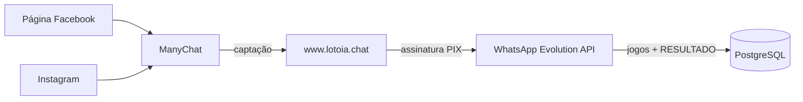

# ADR-012 — ManyChat como Canal de Captação Facebook + Instagram

| Campo | Valor |
|-------|-------|
| **Status** | Accepted |
| **Data** | 12/06/2026 |
| **Missão** | M-094 |
| **Substitui** | Integração nativa Messenger (webhook próprio + App Review Meta) |

---

## Contexto

A integração direta com Facebook Messenger via API nativa **não obteve aprovação operacional** (App Review Meta pendente/rejeitado). O canal permaneceu indisponível para captação e atendimento em Página/Instagram.

O WhatsApp via **Evolution API** segue como **canal principal de operação**:
- geração de jogos
- conferência de resultados (`RESULTADO`)
- persistência PostgreSQL (Lei No 001)

**ManyChat** passa a atuar como **porteiro** — não como operador:
- responde DM e comentários em Facebook Page + Instagram
- captura lead
- direciona para assinatura em `www.lotoia.chat`
- após assinatura, operação continua exclusivamente no WhatsApp

---

## Decisão

Adotar **ManyChat** (SaaS externo) para captação em redes sociais, descontinuando a integração nativa Messenger como caminho institucional principal.

| Aspecto | Decisão |
|---------|---------|
| Plataforma | [manychat.com](https://manychat.com) |
| Plano inicial | Free (limite ~1.000 contatos) |
| Upgrade | Pro quando necessário |
| Configuração | Manual no painel ManyChat (sem código no repositório) |
| Operação | WhatsApp Evolution API (inalterado) |

---

## Escopo ManyChat (M-094)

### Etapa 1 — Conta e conexão (ADM)

1. Criar conta com e-mail institucional LotoIA
2. Conectar Página Facebook **LotoIA**
3. Conectar Instagram **LotoIA**

### Etapa 2 — DM Facebook

**Trigger:** qualquer DM na Página

**Mensagem 1 (boas-vindas):**
```
👋 Olá! Aqui é a LotoIA.

Somos uma plataforma de análise estatística
da Lotofácil — jogos gerados com ciência de dados,
não com sorte.

Para conhecer nossos planos e receber seus jogos
direto no WhatsApp, acesse:
👉 www.lotoia.chat

Alguma dúvida? Responda aqui! 😊
```

**Mensagem 2 (se usuário responder):**
```
Que bom que você quer saber mais! 🎯

A LotoIA analisa padrões reais da Lotofácil:
✅ Janela de repetição entre concursos
✅ Ciclos de dezenas frias e quentes
✅ Equilíbrio baixas (1-12) e altas (13-25)
✅ Estrutura — não aleatoriedade

Planos a partir de R$15,99/mês via PIX.
👉 www.lotoia.chat

Loteria é jogo de azar. Jogue com
responsabilidade. +18
```

### Etapa 3 — DM Instagram

**Trigger:** qualquer DM no Instagram LotoIA

```
👋 Olá! Aqui é a LotoIA.

Análise estatística da Lotofácil —
jogos com estrutura, não com achismo. 🎯

Conheça nossos planos:
👉 www.lotoia.chat

Seus jogos chegam direto no WhatsApp
após a assinatura. 📱
```

### Etapa 4 — Comentários Facebook

**Trigger:** qualquer comentário nos posts da Página

**Resposta pública:**
```
Olá! 👋 Que bom que você se interessou!
Te mandei uma mensagem no privado. 😊
```

**DM automático:**
```
Oi! Vi seu comentário na nossa página. 🎯

A LotoIA usa análise estatística para gerar
jogos da Lotofácil com estrutura real.

Quer conhecer? Acesse:
👉 www.lotoia.chat

Planos a partir de R$15,99/mês via PIX.
Seus jogos chegam no WhatsApp! 📱

Loteria é jogo de azar.
Jogue com responsabilidade. +18
```

### Etapa 5 — Comentários Instagram

**Trigger (keywords):** `quero`, `como`, `funciona`, `preço`, `plano`, `lotofácil`, `jogo`, `info`

**Resposta pública:**
```
Oi! 👋 Te mandei um direct com mais informações!
```

**DM automático:**
```
Olá! 🎯 Vi seu comentário.

A LotoIA analisa padrões reais da Lotofácil
e entrega jogos com estrutura estatística
direto no seu WhatsApp.

Conheça os planos:
👉 www.lotoia.chat

Loteria é jogo de azar.
Jogue com responsabilidade. +18
```

### Etapa 6 — Keyword triggers (DM)

| Keyword | Resposta |
|---------|----------|
| `PLANOS` / `PREÇO` | Tabela de planos + `www.lotoia.chat` |
| `COMO FUNCIONA` | 4 pilares estatísticos + link |
| `RESULTADO` | Resultados exclusivos para assinantes via WhatsApp |
| `OI` / `OLÁ` | Fluxo de boas-vindas padrão |

---

## Arquitetura de canais



---

## Referência operacional

| Item | Valor |
|------|-------|
| Painel ManyChat | `https://app.manychat.com/` (atualizar após conta criada) |
| Landing assinatura | `https://www.lotoia.chat` |
| Plano contratado | Free (inicial) |
| Limite contatos | ~1.000 (Free) |
| Revisão institucional | 30 dias após go-live |

Variáveis de ambiente (painel ADM / Railway):

```bash
MANYCHAT_STATUS=aguardando_configuracao   # ativo | inativo
MANYCHAT_PANEL_URL=https://app.manychat.com/
MANYCHAT_CONTACTS=
MANYCHAT_PLAN=Free
LOTOIA_CHAT_URL=https://www.lotoia.chat
```

---

## Código legado (Messenger nativo)

Os módulos abaixo permanecem no repositório como **legado**, sem promoção operacional:

- `backend/messenger_webhook.py`
- `src/lotoia/clients/messenger_consultor/`
- `src/lotoia/clients/messenger_service.py`

**Regra:** não expandir integração nativa Messenger sem nova ADR e aprovação institucional.

---

## Critérios de aceite — Auditor

- [ ] ManyChat conectado à Página Facebook LotoIA
- [ ] ManyChat conectado ao Instagram LotoIA
- [ ] DM automático funcionando em ambos os canais
- [ ] Comentários disparam DM automaticamente
- [ ] Keywords respondem corretamente
- [ ] Todos os fluxos direcionam para `www.lotoia.chat`
- [ ] ADR-012 documentado no repositório
- [ ] Card de canal no painel ADM (`dashboard/pages/canais.py`)
- [ ] Nenhum fluxo promete ganhos ou resultados
- [ ] Rodapé de responsabilidade (+18) em todas as mensagens

---

## Regra institucional

> **ManyChat é porteiro — não operador.**
> Captura o lead e entrega para o WhatsApp.
> Nunca substitui o bot Evolution API.

---

## Consequências

### Positivas

- Captação em Facebook/Instagram sem dependência de App Review customizado
- Separação clara: captação (ManyChat) vs operação (WhatsApp)
- Configuração rápida pelo ADM sem deploy de código

### Negativas / Riscos

- Dependência de SaaS externo (custo, limites, políticas Meta)
- Sincronização manual de mensagens institucionais entre ManyChat e repositório
- Código Messenger legado pode gerar confusão se não documentado

---

## Referências

- M-094 — ManyChat Captação Facebook + Instagram (12/06/2026)
- `docs/governance/COMUNICACAO_INSTITUCIONAL.md`
- `dashboard/pages/canais.py` — card de referência no painel ADM
