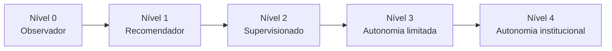

# M-AGENT-001 — Roadmap de Níveis de Autonomia (`agent_operador_ml`)

| Campo | Valor |
|-------|-------|
| **Missão** | M-AGENT-001 |
| **Agente** | `agent_operador_ml` |
| **Status** | Especificação — sem implementação |

---

## Visão geral

Cada avanço exige: ADR ou emenda aprovada por `agent_governanca`, suite de testes, auditoria e rollback documentado.

---

## Nível 0 — Observador

| Atributo | Definição |
|----------|-----------|
| **Missão alvo** | M-AGENT-002 (recomendada) |
| **Pode** | Ler PostgreSQL, painéis, memórias; consolidar diagnóstico; emitir `agent_trace_id` e relatório |
| **Não pode** | Recomendar com persistência, alterar `context_json`, acionar calibração ou geração |
| **Autonomia** | 0% ação operacional |

### Requisitos de promoção ao Nível 1

- [ ] Módulo observador em `src/lotoia/governance/` ou `src/lotoia/ml/` (read-only)
- [ ] Cobertura de fontes §4 da Constituição
- [ ] Testes: ingestão sem side-effects; zero writes em `generation_events`
- [ ] Relatório JSON com `agent_reasoning_summary` por lote
- [ ] Aprovação `agent_governanca` + regressão `agent_qualidade`

---

## Nível 1 — Recomendador

| Atributo | Definição |
|----------|-----------|
| **Missão alvo** | M-AGENT-003 (futura) |
| **Pode** | Todas as ações §5.2; exibir na Central ML; handoff `responsible_cursor_agent` |
| **Não pode** | Executar calibração, gerar jogos, persistir promoção sem operador |
| **Autonomia** | Recomendação apenas; operador humano obrigatório |

### Requisitos de promoção ao Nível 2

- [ ] ≥ 30 ciclos de recomendação auditados com `agent_observed_effect` preenchido
- [ ] Taxa de aceitação operador ≥ limiar definido em ADR
- [ ] Integração com matriz M-GOV-AGENTS-002 em cada `decision_block`
- [ ] Zero violações P1–P13 em auditoria
- [ ] Card “Recomendação do Operador ML” na Central ML (`agent_visual`)

---

## Nível 2 — Supervisionado

| Atributo | Definição |
|----------|-----------|
| **Missão alvo** | M-AGENT-004 (futura) |
| **Pode** | Ações §5.3 com plano autorizado pré-existente; anotar `context_json`; reclassificação estrutural auditada |
| **Não pode** | Autorizar calibração sozinho; alterar Lei 15; purge |
| **Autonomia** | Execução de planos já aprovados; confirmação operador para exceções |

### Requisitos de promoção ao Nível 3

- [ ] ADR específico de autonomia limitada
- [ ] Walk-forward em ações supervisionadas (≥ 3 ciclos temporais)
- [ ] Rollback automatizado testado em staging
- [ ] Comparativo antes/depois em `agent_operational_learning`
- [ ] Aprovação formal `agent_governanca` + `agent_qualidade`

---

## Nível 3 — Autonomia limitada

| Atributo | Definição |
|----------|-----------|
| **Missão alvo** | M-AGENT-005+ (futura) |
| **Pode** | Ações §5.4 dentro de limites ADR; recovery pré-GP; promoção parcial automática |
| **Não pode** | Mutar thresholds globais; violar CORE_002; operar sem `agent_trace_id` |
| **Autonomia** | Loop fechado com guardrails e circuit breaker |

### Requisitos de promoção ao Nível 4

- [ ] ADR de autonomia institucional
- [ ] Benchmark comparativo vs. operador humano (estrutural, não hits)
- [ ] Redução comprovada de recalibrações improdutivas (critérios §9 Constituição)
- [ ] Auditoria externa / snapshot institucional
- [ ] Plano de contingência e kill-switch operacional

---

## Nível 4 — Autonomia institucional

| Atributo | Definição |
|----------|-----------|
| **Pode** | Orquestrar ciclo completo Diagnóstico→Aprendizado com supervisão de exceção |
| **Limites permanentes** | Proibições absolutas §6 da Constituição |
| **Autonomia** | Máxima permitida pela governança LotoIA |

### Salvaguardas permanentes (não negociáveis)

- Lei 15 / CORE_002 soberanos
- ML auxiliar (POLITICA_ML_ASSISTIVO)
- PostgreSQL como fonte operacional
- `agent_governanca` pode revogar autonomia por ADR
- Kill-switch: `LOTOIA_AGENT_OPERADOR_ML_DISABLED=1`

---

## Cronograma técnico (missões sugeridas)

| Fase | Missão | Nível | Entregável |
|------|--------|-------|------------|
| 1 | M-AGENT-002 | 0 | Observador read-only + testes |
| 2 | M-AGENT-003 | 1 | Recomendador + UI Central ML |
| 3 | M-AGENT-004 | 2 | Execução supervisionada + memória `agent_operational_learning` |
| 4 | M-AGENT-005 | 3 | Autonomia limitada + rollback |
| 5 | M-AGENT-006 | 4 | Autonomia institucional (condicional) |

*Nota: datas não são compromisso desta missão constitucional; sequência é dependência técnica.*

---

## Indicadores por nível

| Nível | KPI principal |
|-------|---------------|
| 0 | Cobertura de leitura 100% das fontes mapeadas |
| 1 | Precisão de recomendação vs. ação humana |
| 2 | Taxa de sucesso pós-plano autorizado |
| 3 | Δ reprovações / Δ promoção parcial |
| 4 | Eficácia sustentada em benchmark temporal |
