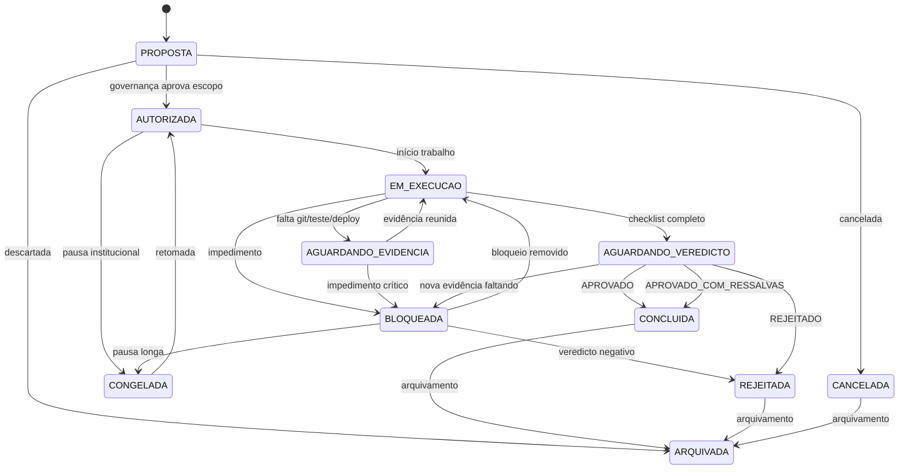

# Matriz de Status das Tarefas — LotoIA

Define estados oficiais, transições permitidas, bloqueios e critérios de saída.

**Política:** `POLITICA_GESTAO_PROJETOS_LOTOIA.md`

---

## 1. Estados oficiais

| Status | Código | Descrição | Quem pode definir |
|--------|--------|-----------|-------------------|
| Proposta | `PROPOSTA` | Ideia ou ordem registrada, sem autorização | Qualquer agente |
| Autorizada | `AUTORIZADA` | Escopo e agente aprovados | `agent_governanca` |
| Em execução | `EM_EXECUCAO` | Trabalho ativo em branch/commits | Agente primário |
| Aguardando evidência | `AGUARDANDO_EVIDENCIA` | Falta Git, teste ou deploy | Agente primário |
| Bloqueada | `BLOQUEADA` | Impedimento formal; trabalho parado | `agent_governanca` ou origem do bloqueio |
| Aguardando veredicto | `AGUARDANDO_VEREDICTO` | Evidências completas; decisão pendente | Agente primário |
| Concluída | `CONCLUIDA` | Veredicto positivo (`APROVADO` ou `APROVADO_COM_RESSALVAS`) | `agent_governanca` |
| Congelada | `CONGELADA` | Pausa institucional; pode retomar | `agent_governanca` |
| Rejeitada | `REJEITADA` | Veredicto `REJEITADO` | `agent_governanca` |
| Arquivada | `ARQUIVADA` | Encerrada sem retomada prevista | `agent_governanca` |
| Cancelada | `CANCELADA` | Abortada antes de entregar | Agente primário + governança |

---

## 2. Diagrama de transições

---

## 3. Matriz de transição (tabela)

| De \ Para | `AUTORIZADA` | `EM_EXECUCAO` | `AGUARDANDO_EVIDENCIA` | `BLOQUEADA` | `AGUARDANDO_VEREDICTO` | `CONCLUIDA` | `CONGELADA` | `REJEITADA` | `ARQUIVADA` | `CANCELADA` |
|-----------|:---:|:---:|:---:|:---:|:---:|:---:|:---:|:---:|:---:|:---:|
| `PROPOSTA` | ✓ | | | | | | ✓ | | ✓ | ✓ |
| `AUTORIZADA` | | ✓ | | | | | ✓ | | ✓ | ✓ |
| `EM_EXECUCAO` | | | ✓ | ✓ | ✓ | | ✓ | | | ✓ |
| `AGUARDANDO_EVIDENCIA` | | ✓ | | ✓ | | | | | | |
| `BLOQUEADA` | | ✓ | | | | | ✓ | ✓ | ✓ | |
| `AGUARDANDO_VEREDICTO` | | | ✓ | ✓ | | ✓ | | ✓ | | |
| `CONCLUIDA` | | | | | | | | | ✓ | |
| `CONGELADA` | ✓ | ✓ | | | | | | | ✓ | |
| `REJEITADA` | | | | | | | | | ✓ | |
| `CANCELADA` | | | | | | | | | ✓ | |

✓ = transição permitida quando critérios da seção 4 forem atendidos.

---

## 4. Critérios por transição

### Para `AUTORIZADA`

- escopo autorizado e proibido escritos no cartão;
- agente primário definido;
- entrada no quadro e registro.

### Para `EM_EXECUCAO`

- missão `AUTORIZADA` ou retomada de `CONGELADA` / `BLOQUEADA`;
- branch Git criada quando houver alteração de artefatos versionáveis.

### Para `AGUARDANDO_EVIDENCIA`

- falta um ou mais itens obrigatórios da seção C, D ou E do checklist;
- deve listar **qual** evidência falta no cartão.

### Para `BLOQUEADA`

- impedimento documentado (auditoria, conflito constitucional, dependência externa);
- campo de bloqueio preenchido no cartão e quadro;
- **proibido** considerar deploy de produção validado enquanto bloqueada.

### Para `AGUARDANDO_VEREDICTO`

- checklist obrigatório completo para o tipo de missão;
- evidência Git presente;
- testes e deploy marcados OK ou N/A com justificativa.

### Para `CONCLUIDA`

- veredicto `APROVADO` ou `APROVADO_COM_RESSALVAS` no registro;
- quadro e registro atualizados no mesmo ciclo Git quando possível.

### Para `REJEITADA`

- veredicto `REJEITADO` com motivo;
- nenhum deploy pendente deve ser promovido.

### Para `CONGELADA`

- pausa institucional explícita;
- não equivale a conclusão — retomada exige revalidação de escopo.

### Para `ARQUIVADA` / `CANCELADA`

- motivo registrado;
- links para commits e veredictos preservados.

---

## 5. Bloqueios institucionais conhecidos (seed Fase 0)

| Código | Condição | Efeito nas transições |
|--------|----------|------------------------|
| `BLK-GIT-001` | Alteração local sem commit/push | Não pode ir a `AGUARDANDO_VEREDICTO` |
| `BLK-TEST-001` | Código alterado sem pytest/ruff | Não pode ir a `AGUARDANDO_VEREDICTO` |
| `BLK-DEPLOY-001` | Deploy exigido sem SHA validado | Não pode ir a `CONCLUIDA` |
| `BLK-LEI15-001` | Missão mexe em geração sem ADR | Deve ir a `BLOQUEADA` |
| `BLK-ADM-001` | Painel ADM conflitante (auditoria 2026-06-17) | Missões ADM ficam `BLOQUEADA` até veredicto |
| `BLK-VER-001` | Sem veredicto formal | Não pode ir a `CONCLUIDA` |

---

## 6. Mapeamento veredicto → status final

| Veredicto | Status final usual |
|-----------|-------------------|
| `APROVADO` | `CONCLUIDA` → `ARQUIVADA` |
| `APROVADO_COM_RESSALVAS` | `CONCLUIDA` (ressalvas no registro) |
| `BLOQUEADO` | `BLOQUEADA` |
| `REJEITADO` | `REJEITADA` → `ARQUIVADA` |
| `CONGELADO` | `CONGELADA` |

---

## 7. Responsabilidades

| Papel | Ação |
|-------|------|
| Agente primário | Atualiza cartão, solicita transição, reúne evidências |
| `agent_governanca` | Autoriza escopo, emite veredicto, desbloqueia quando aplicável |
| `agent_plataforma` | Valida evidência de deploy e runtime |
| `agent_qualidade` | Valida evidência de testes quando escopo inclui código |

---

## Referências

- [`CHECKLIST_MISSAO_OBRIGATORIO.md`](CHECKLIST_MISSAO_OBRIGATORIO.md)
- [`QUADRO_PROJETOS_MISSOES.md`](QUADRO_PROJETOS_MISSOES.md)
- [`REGISTRO_MISSOES_INSTITUCIONAL.md`](REGISTRO_MISSOES_INSTITUCIONAL.md)
